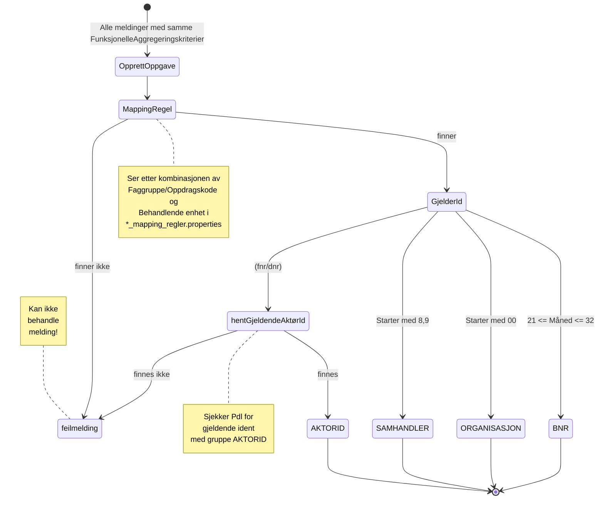

# Opprette oppgaver

## Aggregering
Først deles oppgavene inn etter FunksjonelleAggregeringskriterier

### OsMeldingFunksjonelleAggregeringsKriterier
Meldinger fra OS deles inn etter Faggruppe, GjelderId, GjelderIdType og AnsvarligEnhetId.

### UrMeldingFunksjonelleAggregeringsKriterier
Meldinger fra UR deles inn etter Oppdragskode, GjelderId, GjelderIdType og AnsvarligEnhetId.

## Opprettelse av oppgave

### Mappingregel
Vi behandler bare kombinasjonene av 
Faggruppe og BehandlendeEnhetNummer (OS) og 
kombinasjonen av Oppdragskode og BehandlendeEnhetNummer (UR) 
som er listet opp i filene os_mapping_regler.properties og ur_mapping_regler.properties
i resources-mappen.

Hvis kombinasjonene ikke finnes der, behandler vi ikke meldingene.

Kombinasjonen avgjør hvilken enhet (4819 eller 4151) som skal bli satt på Oppgaven.
I tillegg avgjør det hvilket behandlingstema eller hvilken behandlingstype som blir satt på Oppgaven.

### GjelderId
Felter Gjelder-ID kan inneholde forskjellige identifikatorer på hvem Meldingen Gjelder.

#### Organisasjon
Hvis GjelderId starter med to nuller fastslår vi at det er et nisifret orgnummer. 
Vi kaster de to nullene og setter Orgnummeret i Oppgaven uten å slå opp dette i noe register.

#### Samhandler
Hvis GjelderId starter på 8 eller 9 fastslår vi at det er en Samhandler.
Nummeret settes som Samhandlernr.

#### BNR
Hvis tredje og fjerde siffer i GjelderId starter på 21-32, fastslår vi at det er et BNR.
Nummeret settes som Bnr i Oppgaven.

#### Fødselsnummer eller D-nummer
Hvis det ikke er en av de andre GjelderId-typene, fastslår vi at det er et fødselsnummer eller D-nummer
og slår dette opp i PDL. I svaret fra PDL antar vi det er en Aktørid, og det er denne vi bruker i Oppgaven.

### Oppgaven som produseres

#### Oppgavetypekode 
blir OKO_OS eller OKO_UR. 
#### Fagomradekode 
blir OKO. 
#### Prioriteten 
er LAV. 
#### Aktiv fra og til 
Fra dagens dato til dagens dato + 7 dager(OS) eller 3 dager(OS)

## Beskrivelse
Hver oppgave tar inn en liste med meldinger som er fra samme faggruppe/oppdragskode, gjelderId og ansvarlig enhet.
Det kan dermed være flere forskjellige "Nyeste ventestatus", og disse skal alle være synlige i den endelige beskrivelsen.

### Merke
I Beskrivelsesfeltet settes det inn to semikolon etter første ventestatus. Dette er et felt
som brukes av NØP til å merke hvorfor de ikke har lukket oppgaven ennå.
Det er maksimalt 10 tegn.
