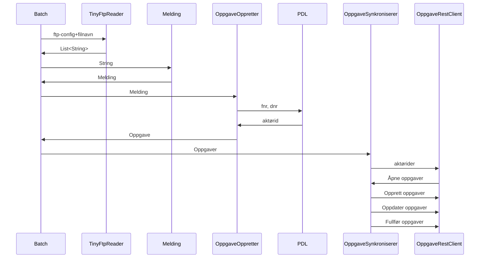
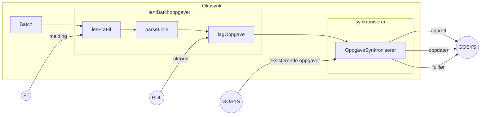
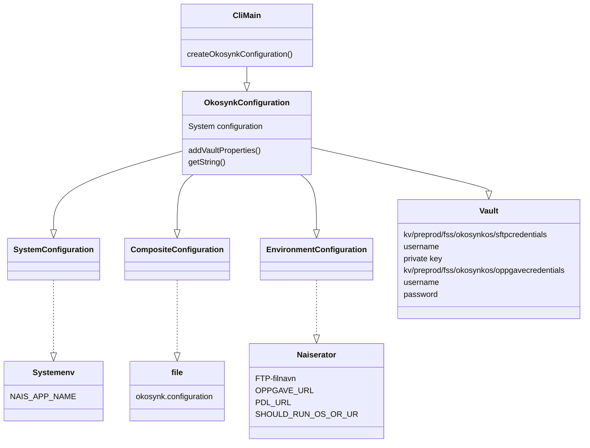

# Okosynk - teknisk oversikt

# Konfigurasjon av Okosynk
Konfigurasjon er satt opp ved at man oppretter en singleton av klassen OkosynkConfiguration

## Les fra fil
Her leses meldingene fra OS og UR fra fil og meldinger uten mappingregel filtreres bort. 
Se [Les fra fil](lesfrafil.md)

## OppgaveOppretter
Meldingene aggregeres og oversettes til oppgaver.
Se [Oppgaveopprettelse](oppgave.md)

## Les fra Gosys
Meldinger som er opprettet av okosynk for de aktuelle aktørene hentes fra Gosys.
Disse sammenlignes med oppgavene som er opprettet fra fil.

## Synkronisering
Sammenligning av oppgaver gjøres med hashcode og equals-metodene til klassen Oppgave.
Det er en manglende symmetri mellom dem i at hashcode ikke tar med aktørid/folkeregisterident, 
som likevel brukes i equals-metoden.

### Opprettelse av nye oppgaver
Oppgaver som er opprettet fra meldinger i fila, men ikke finnes fra før i Gosys, opprettes.

### Ferdigstilling av oppgaver
Oppgaver som finnes fra før, men ikke er i filen, ferdigstilles.

### Oppdatering av oppgaver som fortsatt er åpne
Oppgaver som finnes fra før oppdateres med ny informasjon fra fila, og vi tar vare på inntil 10 tegn som er lagret i 
meldingen som ligger i Gosys og skal videreføres til den oppdaterte oppgaven.
