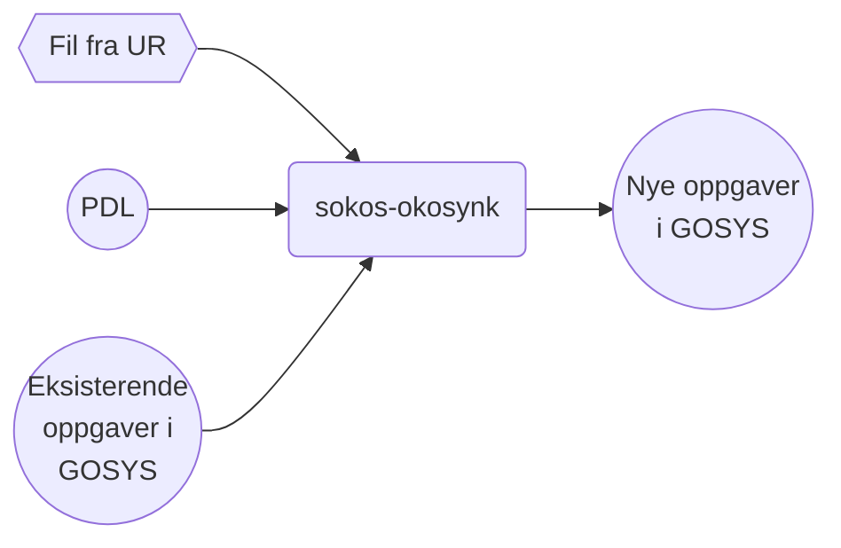

# sokos-okosynk

# Innholdsoversikt

* [1. Funksjonelle krav](#1-funksjonelle-krav)
* [2. Utviklingsmiljø](#2-utviklingsmiljø)
* [3. Programvarearkitektur](#3-programvarearkitektur)
* [4. Deployment](#4-deployment)
* [5. Autentisering](#5-Autentisering)

# 1 Funksjonelle Krav

Applikasjon for å synkronisere oppgaver fra økonomisystemene OS (Oppdragssystemet) og UR (Utbetalingsreskontro) mot oppgave-applikasjonen (tidligere Gsak).
Applikasjonen leser flatfiler bestående av meldinger fra OS og UR. Noen av meldingene aggregeres
dersom de gjelder samme oppgave. Fra de resterende meldingene opprettes det oppgaver, og det er
disse oppgavene som skal ligge i oppgave-applikasjonen.

# 2. Utviklingsmiljø

### Forutsetninger

* Java 21
* Gradle
* [Kotest](https://plugins.jetbrains.com/plugin/14080-kotest) plugin for å kjøre tester
* [Docker](https://www.docker.com/) for å kjøre testcontainers

### Bygge prosjekt

Du må ha Docker på for å bygge prosjektet da bygging også kjører tester med testcontainers.

```
./gradlew clean build shadowJar
```

### Lokal utvikling

For å kjøre applikasjonen lokalt må du gjøre følgende:

- Kjør scriptet [setupLocalEnvironment.sh](setupLocalEnvironment.sh)
  ```
  chmod 755 setupLocalEnvironment.sh && ./setupLocalEnvironment.sh
  ```
  Denne vil opprette [default.properties](defaults.properties) med alle environment variabler du trenger for å kjøre
  applikasjonen som er definert i [PropertiesConfig](src/main/kotlin/no/nav/sokos/spk/mottak/config/PropertiesConfig.kt).

### Miljøer

`sokos-okosynk` kjøres i følgende miljøer:

- dev-fss (Q-miljø)
- prod-fss (prod-miljø)

`sokos-okosynk` er en batchjobb som kjører kl. UTC 4:00 hver morgen hele året (altså kl 05:00 om vinteren og kl 0:600 om sommeren norsk tid).
Den kjører på nais-plattformen i to miljøer:

1) Cluster `dev-fss`, i namespace `okonomi`
2) Cluster `prod-fss`, i namespace `okonomi`

`sokos-okosynk` kjøres som en sekvensielle jobb, som heter henholdsvis okosynkos og okosynkur.

### Logging

Resultatet kan kontrolleres ved å se på loggene i Kibana.
Loggen konfigureres i `src/main/resources/logback.xml`.
Forhåpentligvis vil loggene ende opp i Kibana (`https://logs.adeo.no`), men man kan også
lese dem direkte fra Kubernetes. Først må man få en liste av pods tilhørende okosynk:

### Alarmer

Applikasjonen bruker [Grafana Alerting](https://grafana.nav.cloud.nais.io/alerting/) for overvåkning og varsling.
Dette er konfigurert via NAIS sin [alerting-integrasjon](https://doc.nais.io/observability/alerts).

Alarmene overvåker metrics som:

- HTTP-feilrater
- JVM-metrikker

Varsler blir sendt til følgende Slack-kanaler:

- Dev-miljø: [#team-mob-alerts-dev](https://nav-it.slack.com/archives/C042SF2FEQM)
- Prod-miljø: [#team-mob-alerts-prod](https://nav-it.slack.com/archives/C042ESY71GX)

### Grafana

- [sokos-okosynk](https://grafana.nav.cloud.nais.io/d/aelylbkr2xmv4b/sokos-okosynk)

# 3. Programvarearkitektur




* Oppgaver som ligger i oppgave-applikasjonen, men ikke er tilstede i flatfil, ferdigstilles.
* Oppgaver som ligger både i oppgave-applikasjonen og i flatfil oppdateres med ny informasjon.
* Oppgaver som ligger i flatfil men ikke i oppgave-applikasjonen blir opprettet i oppgave-applikasjonen.

[Teknisk oversikt](Dokumentasjon/overordnet-teknisk.md) over `sokos-okosynk`

# 4. Deployment

Distribusjon av tjenesten er gjort med bruk av Github Actions.
[sokos-okosynk CI / CD](https://github.com/navikt/sokos-okosynk/actions)

Push/merge til main branch direkte er ikke mulig. Det må opprettes PR og godkjennes før merge til main branch.
Når PR er merged til main branch vil Github Actions bygge og deploye til dev-fss og prod-fss.
Har også mulighet for å deploye manuelt til testmiljø ved å deploye PR.

# 5. Autentisering

Applikasjonen har ingen restApi endepunkt og har ingen autentiseringsbehov.
