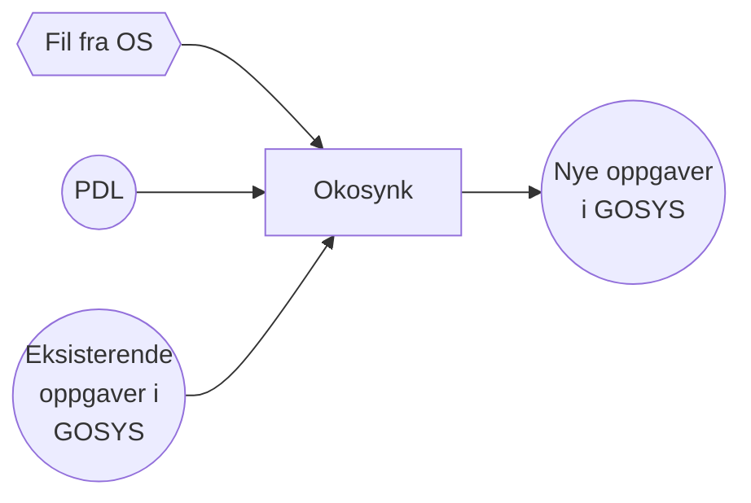

# Okosynk - Funksjonell oversikt
Applikasjon for å synkronisere oppgaver fra økonomisystemene OS (Oppdragssystemet) og UR (Utbetalingsreskontro) mot oppgave-applikasjonen (tidligere Gsak).
Applikasjonen leser flatfiler bestående av meldinger fra OS og UR. Noen av meldingene aggregeres
dersom de gjelder samme oppgave. Fra de resterende meldingene opprettes det oppgaver, og det er
disse oppgavene som skal ligge i oppgave-applikasjonen.




* Oppgaver som ligger i oppgave-applikasjonen, men ikke er tilstede i flatfil, ferdigstilles.
* Oppgaver som ligger både i oppgave-applikasjonen og i flatfil oppdateres med ny informasjon.
* Oppgaver som ligger i flatfil men ikke i oppgave-applikasjonen blir opprettet i oppgave-applikasjonen.

Okosynk er en batchjobb som kjører kl. UTC 4:00 hver morgen hele året (altså kl 05:00 om vinteren og kl 0:600 om sommeren norsk tid).
Den kjører på nais-plattformen i to miljøer:
1) Cluster `dev-fss`, i namespace `okonomi`
2) Cluster `prod-fss`, i namespace `okonomi`

Okosynk kjøres som to separate jobber, og de heter hhv. okosynkos og okosynkur (nais name). Det er samme koden som kjører, 
men de er konfigurert forskjellig. 
Miljø-variabelen SHOULD_RUN_OS_OR_UR styrer dette, og den kan ha verdiene "OS" eller "UR".

# Teknisk oversikt
[Teknisk oversikt](Dokumentasjon/overordnet-teknisk.md) over Okosynk

# Testkjøring av batchen

## Testkjøring av batchen i dev
1. Sjekk adressen(e) til inputfil(ene) i nais/app-preprod.yaml under `FTPBASEURL_URL`
0. Legg filene du ønsker å teste der, eller rename allerede kjørt(e) fil(er). (Etter en vellykka kjøring blir nemlig inputfilene renama med en timestamp)
0. Start en batchkjøring som beskrevet annet sted i denne dokumentasjonen.

# Bygg og deployment
## Lokalt
`mvn clean install`
## Preprod/Prod
Ved innsjekking til main-greina på GitHub bygges og deployeres okosynk implisitt til både preprod og prod.
Dette skjer på GitHub vha. action-scriptet
`<PROJECT ROOT>/.github/workflows/deploy-dev-prod.yaml` 
Hvis dette ikke er ønskelig, bør man vurdere å arbeide på en egen grein.

Oppretter man en egen grein, vil ingenting skje før man oppretter en pull request, 
Det anbefales at man setter denne til Draft, slik at man bygger og kjører tester hver gang man pusher til branchen.

Ønsker man så å teste ut endringen i dev kjører man `<PROJECT ROOT>/.github/workflows/manuell-deploy-dev.yml`.

# Sjekk hvordan det står til i drift

```
kubectl config use-context <riktig cluster> (enten `dev-fss` eller `prod-fss`)
kubectl config set-context <riktig cluster> --namespace=<riktig namespace> (<riktig namespace> er `okonomi` uavhengig av om det er `dev` eller `prod`)
```

Ved å kjøre

`kubectl get cronjobs`  

får man en liste over alle cronjobs i dette
namespacet, og okosynkos/ur skal være blant dem.

Man får et resultat alla det her:

```
NAME      SCHEDULE    SUSPEND   ACTIVE    LAST SCHEDULE   AGE
okosynkos   0 5 * * *   False     0         3h              2d
```

Dette viser at cronjob-en kjører 0 5 * * *, som betyr kl 05:00 UTC hver dag. Man
ser også "last schedule" som er hvor lenge det er siden siste kjøring, og "age" som
er hvor lenge det er siden cronjob-en ble deployet i ny versjon.

Så kan man gjøre

`kubectl get jobs`,

og da får man opp noe som kan ligne på det følgende:

```
NAME                                               COMPLETIONS   DURATION   AGE
okosynkos-1626667200                               0/1           4h55m      4h55m
okosynkur-1626667200                               0/1           4h55m      4h55m
```

En cronjob i Kubernetes vil opprette en ny `job` for hver kjøring. Standard oppførsel
er at disse jobbene blir liggende igjen etter at de er ferdige, slik at man kan lese ut
logger osv. De blir automatisk slettet etter en tid. (Man kan konfigurere og fine-tune
når de skal slettes, men Kubernetes har en fin default.)

Hvis det ligger veldig mange jobber inne i clusteret, kan man f.eks. kjøre

`kubectl get jobs | grep okosynk`

for kun å få okosynk-jobbene. (Det er usikkert hvordan
`grep` vil fungere fra et Windows-image. Antakeligvis har kubectl et kommandolinjeflagg
for å filtrere jobber.)

I lista over jobber kan man se når alle jobbene sist kjørte, og antall forsøk de trengte
for å være successful - i dette tilfellet var det enkelt, alle jobbene kjørte fint på
første forsøk.

# Hvordan gikk kjøringene?

## Logging
Resultatet kan kontrolleres ved å se på loggene i Kibana. Se særlig etter strengen `STATISTIKK`.
Loggen konfigureres i `src/main/resources/logback.xml`.
Forhåpentligvis vil loggene ende opp i Kibana (`https://logs.adeo.no`), men man kan også
lese dem direkte fra Kubernetes. Først må man få en liste av pods tilhørende okosynk:

`kubectl get pods`

```
NAME                                                     READY   STATUS     RESTARTS   AGE
okosynkos-1626667200-4rgvn                               1/2     NotReady   0          4h57m
okosynkur-1626667200-htp4t                               1/2     NotReady   0          4h57m
```

Når status er "Completed", gikk jobben bra. "Age" viser når
hver pod begynte å kjøre. Hvis vi skal sjekke loggene til den siste pod-en, kan vi
kjøre

`kubectl logs okosynkos-1626667200-4rgvn okosynkos`
eller
`kubectl logs okosynkur-1626667200-4rgvn okosynkur`
eller
`kubectl logs okosynkos-1626667200-4rgvn vks-sidecar`
eller
`kubectl logs okosynkos-1626667200-4rgvn vks-init`

og da kommer loggene til pod-en opp i terminalen.<BR/>
Og for å finne ut hvorvidt jobbene er vellykka fullførte:

`kubectl logs okosynk-1556078400-gfdhr vks-init | grep -i fullført`

Følgene kommando er heller ikke å forakte (her får du f.eks. lista opp miljøvariablene + mye mer...):<BR/>

`kubectl describe pod okosynk-1536642000-j6ccz`

# Spesifikke Kubernetes-behov i preprod/prod
## Start en batch akkurat nå uavhengig av hva cron schedule tilsier

Fra aktuelt cluster:

```
kubectl create job --from=cronjob/okosynkos "<okosynk-os-oor-manually-started-2021-07-05-12-21>"
kubectl create job --from=cronjob/okosynkur "<okosynk-ur-oor-manually-started-2021-07-05-12-21>"
```

## Slett en jobb

```kubectl delete job oor-manually-started-2020-01-10-18-18```

## Slett en cronjob slik at det ikke dannes nye batch-jobber til konfigurert tid

```kubectl delete cronjob okosynkos```

eller

```kubectl delete cronjob okosynkur```

# General practical commands, hints and tips

- Which ports are being listened to (e.g. to see whether the SFTP server is running and listening to the expected port)
    - ```sudo lsof -i -P | grep -i "listen"``` (MAC)
    - ```netstat -an -ptcp | grep LISTEN``` (MAC)
- En flatfil kan kjøres flere ganger. En oppgave vil oppdateres tilsvarende endringene i flatfilen hver gang, men kun
  ferdigstilles hvis det har gått lengre tid enn 8 timer siden sist oppgaven ble endret.
- Ved lokal utvikling benyttes `src/test/resources/application-test.testset_001.properties` for properties som vanligvis
  vil ligge i yaml/Kubernetes.
- OS - service user srvbokosynk001
- UR - service user srvbokosynk002
- Kjør `java -jar target/okosynk.jar -h` for å se hvilke kommandolinjeparametre som er tilgjengelige
- NB! testdatafilene inneholder binære verdier, så de må editeres med omhu! (F.eks. kan OS-testdatafila inneholde et 
  tegn som fortoner seg som en 'æ', men som _IKKE_ er det, det er derimot en HEX E6.)
- Can some dependencies be updated?
    - `mvn versions:display-dependency-updates`
- Sjekk innholdet i en pod:
    - `kubectl describe jobs okosynk-oor-manually-started-2021-06-30-12-16-ctm66`
- Loggen til Okosynk på en pen måte:
    - Pipe loggoutputen inn i `sed -n '/ENTERING OKOSYNK/,/OKOSYNK ABOUT TO EXIT/p'|jq -r '.logger_name + "\t " + .message'|column -t -s $'\t'`

# Referanser

[Zero trust](https://doc.nais.io/appendix/zero-trust/index.html)

[Nais Application](https://doc.nais.io/nais-application/application/)

[Auth](https://doc.nais.io/security/auth/)

[Azure AD](https://doc.nais.io/security/auth/azure-ad)

[OAuth2](https://docs.microsoft.com/en-us/azure/active-directory/develop/v2-oauth2-auth-code-flow)

[Security Blueprints](https://github.com/navikt/security-blueprints)

[Client credentials](https://github.com/navikt/security-blueprints/tree/master/examples/service-to-service/daemon-clientcredentials-tokensupport/src/main/java/no/nav/security/examples/tokensupport/clientcredentials)

[Security labs](https://security.labs.nais.io/)

[Client Credentials](https://security.labs.nais.io/pages/flows/oauth2/client_credentials.html)

[Maskin til maskin](https://security.labs.nais.io/pages/guide/api-kall/maskin_til_maskin_uten_bruker.html)

[Registrere applikasjon i Azure AD](https://security.labs.nais.io/pages/idp/azure-ad.html#registrere-din-applikasjon-i-azure-ad)
                                                                                                                                 
[Metrics](https://prometheus.io/docs/practices/instrumentation/#avoid-missing-metrics)
