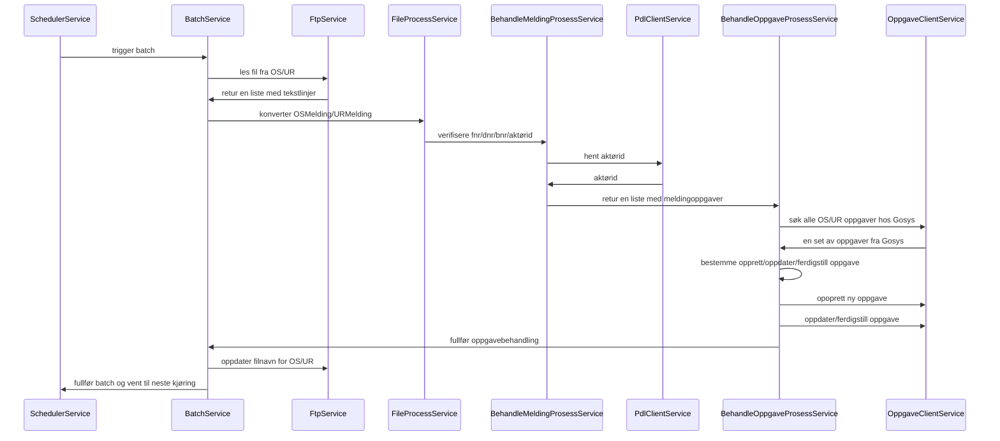

# sokos-okosynk - teknisk oversikt

## Les fra fil

Her leses meldingene fra OS og UR fra fil og meldinger uten mappingregel filtreres bort.
Se [Les fra fil](lesfrafil.md)

## Les fra Gosys

Meldinger som er opprettet av `sokos-okosynk` for de aktuelle aktørene hentes fra Gosys.
Disse sammenlignes med oppgavene som er opprettet fra fil.

## Synkronisering

Sammenligning av oppgaver gjøres gjennom matches til klassen MeldingOppgave og Oppgave.

### Opprettelse av nye oppgaver

Oppgaver som er opprettet fra meldinger i fila, men ikke finnes fra før i Gosys, opprettes.

### Ferdigstilling av oppgaver

Oppgaver som finnes fra før, men ikke er i filen, ferdigstilles.

### Oppdatering av oppgaver som fortsatt er åpne

Oppgaver som finnes fra før oppdateres med ny informasjon fra fila, og vi tar vare på inntil 10 tegn som er lagret i
meldingen som ligger i Gosys og skal videreføres til den oppdaterte oppgaven.
